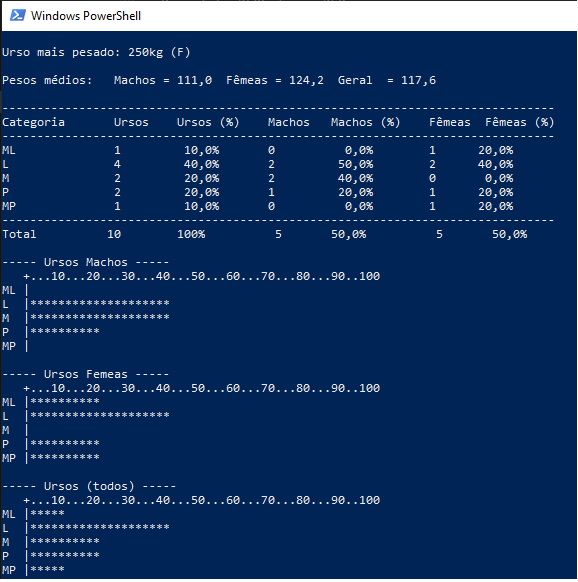

# Ursos

Este programa estará análisando os dados coletados de ursos selvagens. Mostrando:

```
- O sexo e o peso do urso mais pesado;
- A média de peso por sexo;
- Uma tabela de distribuição de frequência;
- Histogramas para ambos os sexos.
```

## Exemplo 
```
Digite a quantidade de Ursos: 10

-- Urso #1 ---       
Peso (até 250kg)...: 120
Sexo (M/F).....: m

-- Urso #2 ---       
Peso (até 250kg)...: 95
Sexo (M/F).....: m

-- Urso #3 ---       
Peso (até 250kg)...: 190
Sexo (M/F).....: f

-- Urso #4 ---       
Peso (até 250kg)...: 250
Sexo (M/F).....: f

-- Urso #5 ---       
Peso (até 250kg)...: 160
Sexo (M/F).....: m

-- Urso #6 ---       
Peso (até 250kg)...: 45
Sexo (M/F).....: f

-- Urso #7 ---       
Peso (até 250kg)...: 60
Sexo (M/F).....: m

-- Urso #8 ---       
Peso (até 250kg)...: 120
Sexo (M/F).....: m

-- Urso #9 ---
Peso (até 250kg)...: 66
Sexo (M/F).....: f

-- Urso #10 ---
Peso (até 250kg)...: 70
Sexo (M/F).....: f

Urso mais pesado: 250kg (F)

Pesos médios:   Machos = 111,0  Fêmeas = 124,2  Geral  = 117,6

-------------------------------------------------------------------------------
Categoria       Ursos    Ursos (%)    Machos   Machos (%)    Fêmeas  Fêmeas (%)
-------------------------------------------------------------------------------
ML              1         10,0%       0          0,0%        1      20,0%
L               4         40,0%       2         50,0%        2      40,0%
M               2         20,0%       2         40,0%        0       0,0%
P               2         20,0%       1         20,0%        1      20,0%
MP              1         10,0%       0          0,0%        1      20,0%
-------------------------------------------------------------------------------
Total          10        100%          5       50,0%          5       50,0%

----- Ursos Machos -----
   +...10...20...30...40...50...60...70...80...90..100
ML |
L  |********************
M  |********************
P  |**********
MP |

----- Ursos Femeas -----
   +...10...20...30...40...50...60...70...80...90..100
ML |**********
L  |********************
M  |
P  |**********
MP |**********

----- Ursos (todos) -----
   +...10...20...30...40...50...60...70...80...90..100
ML |*****
L  |********************
M  |**********
P  |**********
MP |*****
```
## Screenshot



## Download

Baixe o arquivo abaixo. Descompacte na pasta desejada.

[🔗 Download do arquivo .zip](dist/Ursos.zip)

Execute utilizando o comando:

```
dotnet Ursos.dll
```